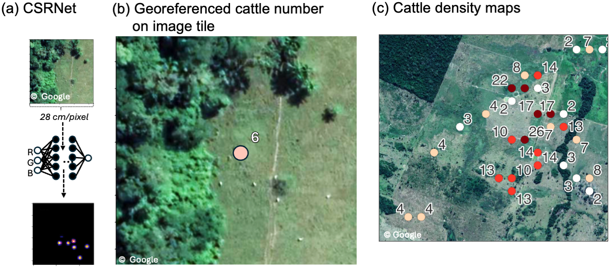

# amazon-cattle-densities

[](https://doi.org/10.1038/s44458-026-00082-2)
[](https://www.nature.com/articles/s44458-026-00082-2)
[](https://www.nature.com/articles/s44458-026-00082-2)

Cattle density maps for the Brazilian Amazon and the property-level analysis linking stocking rates
to deforestation, from [Hodel et al., 2026](https://www.nature.com/articles/s44458-026-00082-2).

> Hodel, L., Wegner, J. D., Sainte Fare Garnot, V., da Rocha Gomes, F. C., Valentim, J. F. &
> Garrett, R. D. Spatial patterns of cattle densities across the Brazilian Amazon revealed by very
> high-resolution satellite imagery. *Communications Sustainability* (2026).



The cattle counts themselves are produced by [deepCattleCount](https://github.com/leoniehodel/deepCattleCount),
a CSRNet ensemble applied to ~30 cm/pixel satellite imagery. This repository picks the counts up from
there: the density maps they add up to, and the regression analysis reported in the paper.

## Data

`data/S3_cattle_maps.geojson` — 96,296 geo-referenced points across Acre, Amazonas, Pará and
Rondônia, one per analysed image tile:

| field | meaning |
| --- | --- |
| `n_cattle` | cattle predicted on the tile, averaged over the ensemble |
| `n_cattle_sd` | standard deviation across the ensemble members |
| `Longitude`, `Latitude` | centre of the tile (EPSG:4326) |
| `img_date` | acquisition date of the underlying image |
| `id_bbox` | image the tile was cut from |
| `state` | Brazilian state |

`code/regression_vars_db_v2.csv`: the analysis table: 2,809 CAR-registered properties with their
stocking rate, deforestation history, land use, distance to the nearest slaughterhouse, and climate
and population controls.

## Reproduce the regression analysis

The analysis runs on the table above and needs R with `tidyverse`, `lubridate`, `fixest`, `broom`,
`ggplot2` and `modelsummary`:

```shell
cd code && Rscript main.R
```

It restricts the sample to images acquired in 2018–2019 and writes three outputs to `results/`:

| output | in the paper |
| --- | --- |
| `summary.html` | Table S6, summary statistics |
| `Supplementary_Table_S7.html` | Table S7, main model and robustness specifications |
| `main_model_coeficients.png` | Figure 3d, coefficient plot |

The environment used for the published run is archived as a Docker image, which reproduces the
results without installing R locally:

```shell
docker run --platform linux/amd64 --rm \
  --workdir /code \
  --volume "$PWD/data":/data \
  --volume "$PWD/code":/code \
  --volume "$PWD/results":/results \
  registry.codeocean.com/published/c6ffd49d-f1a7-47a1-ae73-4a724ffe02cb:v2 bash run
```

## Rebuilding the analysis table from scratch

The scripts under `code/preprocessing/`, run in numbered order and followed by
`01_generate_ind_vars.R` and `02_add_hyperpars.R`, rebuild `regression_vars_db_v2.csv` from the raw
model output. They depend on secondary datasets that are not redistributed here — CAR property
outlines, MapBiomas land use and pasture degradation, deforestation, rural credit, climate and
population. Each script names its source and download location at the top.


## License

Code is MIT licensed (`code/LICENSE`), the cattle density maps are released under CC0
(`data/LICENSE`).
